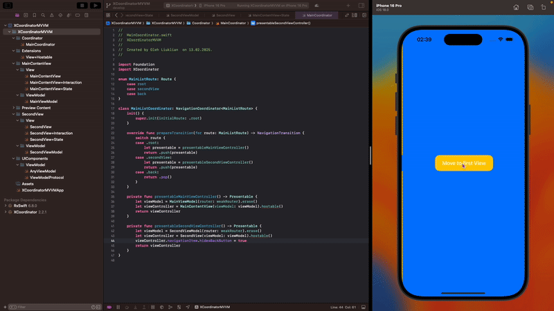

# 📌 MyPortfolio – A Collection of Swift Code & Architectural Solutions

Welcome to **MyPortfolio**, a curated collection of **code snippets**, **architectural patterns**, and **experiments**. This repository isn't just about full-scale projects; it's a space for reusable solutions, exploring best practices, and studying various approaches in iOS development.

---

## 📂 Code & Architecture

### 🏗 MVVM-C, XCoordinator & Various Architectures

> **Scalable navigation** using [XCoordinator](https://github.com/quickbirdstudios/XCoordinator).

- Organizing code with **MVVM-C** for improved modularity and maintainability.
- Exploring different approaches like **Clean Architecture**, **VIPER**, **MVP**, and more.
- Implementing **Dependency Injection** to enhance testability and extensibility.

---

### ⚡ Combine – Reactive Programming

- Utilizing `@Published` and Combine pipelines to manage state.
- Techniques like **debouncing**, **throttling**, and handling asynchronous operations.
- Binding **UI components** to ViewModels with Combine.

---

### 📱 UIKit, Auto Layout & View Building

- **Custom UI components** and animations using `UIView` and `CALayer`.
- Implementing adaptive **Auto Layout** solutions for various devices using visual constraints or libraries like [SnapKit](https://github.com/SnapKit/SnapKit).
- Building views entirely in code—from simple components to complex interfaces.

---

### 📊 Swift Charts & Data Visualization

- Integrating [Swift Charts](https://github.com/danielgindi/Charts) to build dynamic graphs and charts.
- Configuring **animations**, **color schemes**, and **interactivity** within charts.
- Comparing with other data visualization libraries and creating custom solutions.

---

### 🔥 Firebase Integration

- Setting up **Firebase** for authentication, data storage, and analytics.
- Utilizing **Firebase Realtime Database** and **Firestore** for both online and offline data management.
- Integrating **Firebase Cloud Messaging** to handle push notifications.

---

## 🌐 Networking & Data Handling

### 🔗 API Requests & Response Management

> **Asynchronously fetching data** using `URLSession`.

- Handling errors, retrying requests, and decoding **JSON** with **Codable**.
- Designing a scalable **networking layer** for REST APIs.

---

### 🔄 Caching & Offline Storage

- Using **UserDefaults**, **CoreData**, and **FileManager** for local data storage.
- Implementing **caching strategies** to improve performance and reduce network load.

---

## 🛠 Dependency Injection & Testing

> Enhancing **testability** with **Dependency Injection**.

- Creating mock services and unit tests for **MVVM** and other components.
- Using **Snapshot Testing** to ensure UI consistency.
- Automating tests and integrating with **CI/CD** pipelines.

---

## 📂 Other Experiments & Patterns

> **Investigating** various architectural patterns such as **Clean Architecture**, **VIPER**, **MVP**, and more.

- Implementing **asynchronous operations** using **Task**, **async/await**, and **Structured Concurrency**.
- Optimizing **performance**, **profiling**, and **debugging** techniques.
- Experimenting with new **Swift libraries** and emerging technologies.

---

## 🚀 Why This Repository?

This collection serves as a **reference** for iOS development best practices, reusable components, and architectural solutions. Whether you’re interested in **MVVM-C**, **Combine**, **Firebase**, **UIKit Auto Layout**, or modern UI-building techniques, you'll find valuable examples here. From building dynamic charts with **Swift Charts** to exploring diverse architectural approaches, this repository is designed to help you **enhance your Swift skills**.

---

> **Note:** This repository is constantly evolving. Contributions and suggestions are welcome! Feel free to open an issue or make a pull request for improvements.
